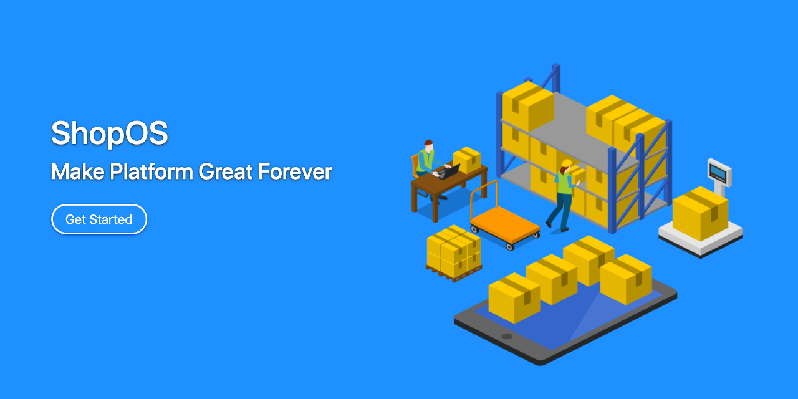

Day one is the first day of the rest of your life.


## Installation

```
From Ubuntu:

Update repository:
sudo apt update

sudo apt install mysql-server
sudo mysql --execute="create database shopos default charset 'UTF8';"
sudo mysql --execute="create user james identified with mysql_native_password by 'bond';"
sudo mysql --execute="grant all on shopos.* to james;"

Install OpenJDK:
sudo apt install default-jdk

Download Tomcat or Jetty stand-alone edition
wget https://codestar.work/tomcat.jar
wget https://codestar.work/jetty.jar

Download Shop OS
wget https://codestar.work/shopos.war

Run the web
sudo java -jar tomcat.jar --port 80 shopos.war

Setup the shop
http://xxx.xxx.xxx.xxx/setup

Finally you can login and add a category and product from the System menu.

Extracting a .war file
mkdir shopos
cd shopos
jar -xf ../shopos.war
cd ..

Don’t forget to set the outgoing email, and enable less secure email.

Changing the temporary folder
sudo java -Djava.io.tmpdir=./photo -jar tomcat.jar --port 80 shopos.war

```

## Useful Links
```
Setup              /setup
Register           /user-register
Activation         /user-activation
Log In             /user-login
Log Out            /user-logout
Home               /user-home
Change Password    /user-change-password

Shopping Basket    /basket
View Orders        /order-list
Shipping Address   /address-list
```

## Web Services

Check Service
```
curl                http://localhost:3000/service/check
curl --request POST http://localhost:3000/service/check-post
```

Log In with Email and Password
```
curl \
--data 'email=user@email.com&password=password' \
--verbose \
--request POST http://localhost:3000/service/user-login
```

Check status of current user
```
curl http://localhost:3000/service/user-current
curl \
--header 'Cookie: JSESSIONID=WXYZ;' \
http://localhost:3000/service/user-current
```


## Testing

### User Acceptance Test (UAT)

General System:

User Registration:

Password Recover:

User Settings:

Checkout and Address:

User Management:

Product and Category Management:


### Compatibility Test

DBMS: MySQL, Oracle, SQL Server, DB2, PostgreSQL


### Performance Test


### Automated Test
The Selenium project is here: https://github.com/kookiatsuetrong/dayone-selenium


## React Native
The React Native mobile application is here: https://github.com/kookiatsuetrong/dayone-mobile


