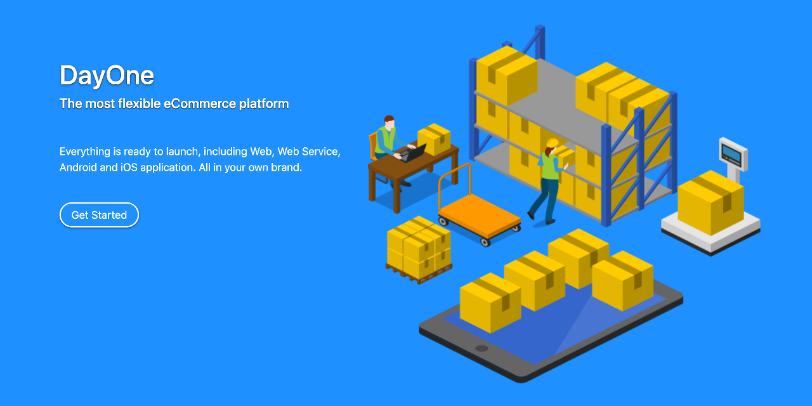

## Demo
The demo web site: http://codestar.work:3000

## Installation

```
From Ubuntu:

Update repository:
sudo apt update

sudo apt install mysql-server
sudo mysql --execute="create database shop default charset 'UTF8';"
sudo mysql --execute="create user james identified with mysql_native_password by 'bond';"
sudo mysql --execute="grant all on shop.* to james;"

Install OpenJDK, zip and tree:
sudo apt install default-jdk zip tree

Download Tomcat or Jetty stand-alone edition
wget https://dayoneteam.com/public/tomcat.jar
wget https://dayoneteam.com/public/jetty.jar

Download DayOne Shop
wget https://dayoneteam.com/public/shop.war

Extracting a .war file
mkdir shop
cd shop
jar -xf ../shop.war
cd ..

sudo java -jar tomcat.jar --port 80 shop

Setup the shop
http://xxx.xxx.xxx.xxx/setup

Finally you can login and add a category and product from the System menu.
Don’t forget to set the outgoing email, and enable less secure email.

```

## Useful Links
```
Setup              /setup
Register           /user-register
Activation         /user-activation
Log In             /user-login
Log Out            /user-logout
Home               /user-home
Change Password    /user-change-password

Shopping Basket    /basket
View Orders        /order-list
Shipping Address   /address-list
```

## Web Services


### Check Status

```
curl                http://localhost:3000/service

curl --request POST http://localhost:3000/service
```

### Login

```
curl \
--data 'email=user@email.com&password=P@ssw0rd' \
--verbose \
--request POST \
http://localhost:3000/service/user-login

curl http://localhost:3000/service/user-current

curl \
--header 'Cookie: JSESSIONID=4F8F394F0C5979BEE7C3D14D3DA1FB0B;' \
http://localhost:3000/service/user-current
```

### List Category / Product
```
curl http://localhost:3000/service/category-list
curl http://localhost:3000/service/product-list
```

### Get Basket
```
curl \
--header 'Cookie: JSESSIONID=4F8F394F0C5979BEE7C3D14D3DA1FB0B;' \
http://localhost:3000/service/basket
```

### Add or Delete Product in Basket
```
curl \
--header 'Cookie: JSESSIONID=4F8F394F0C5979BEE7C3D14D3DA1FB0B;' \
http://localhost:3000/service/basket-add?id=2

curl \
--header 'Cookie: JSESSIONID=4F8F394F0C5979BEE7C3D14D3DA1FB0B;' \
http://localhost:3000/service/basket-decrease?id=2
```

### List Address
```
curl \
--header 'Cookie: JSESSIONID=4F8F394F0C5979BEE7C3D14D3DA1FB0B;' \
http://localhost:3000/service/address-list
```

### Get Address Detail
```
curl \
--header 'Cookie: JSESSIONID=4F8F394F0C5979BEE7C3D14D3DA1FB0B;' \
http://localhost:3000/service/address-detail?id=123
```

### Add Address
```
curl \
--header 'Cookie: JSESSIONID=4F8F394F0C5979BEE7C3D14D3DA1FB0B;' \
--request POST \
--data "name=Receiver&address=123 My Street&city=My City&" \
--data "state=My State&zip=12345&country=THAILAND&" \
--data "phone=+6612345678&email=user@email.com&comment=(No Comment)" \
http://localhost:3000/service/address-save
```

### Delete Address
```
curl \
--header 'Cookie: JSESSIONID=4F8F394F0C5979BEE7C3D14D3DA1FB0B;' \
http://localhost:3000/service/address-delete?id=9
```

### List Orders
```
curl \
--header 'Cookie: JSESSIONID=4F8F394F0C5979BEE7C3D14D3DA1FB0B;' \
http://localhost:3000/service/order-list
```

### Get Order Detail
```
curl \
--header 'Cookie: JSESSIONID=4F8F394F0C5979BEE7C3D14D3DA1FB0B;' \
http://localhost:3000/service/order-detail?id=123
```

### Search Product
```
curl \
--header 'Cookie: JSESSIONID=4F8F394F0C5979BEE7C3D14D3DA1FB0B;' \
http://localhost:3000/service/search?query=abc
```

### Commit to Buy


### List Payment Methods


### Upload Payment Slip


## Application Servers

### Tomcat


### Jetty


### GlassFish

### Open Liberty
```
bin/server create dayone
cp dayone.war usr/servers/dayone/apps

vi usr/servers/dayone/server.xml

<?xml version="1.0" encoding="UTF-8"?>
<server description="new server">
    <featureManager>
        <feature>servlet-4.0</feature>
    </featureManager>

    <httpEndpoint id="app" host="*" httpPort="9001" />
    <webApplication contextRoot="/" location="dayone.war" />
    <applicationManager autoExpand="true"/>
</server>
```

## Database Management System

### MySQL
```
sudo apt install mysql-server
sudo mysql --execute="create database shopos default charset 'UTF8';"
sudo mysql --execute="create user james identified with mysql_native_password by 'bond';"
sudo mysql --execute="grant all on shopos.* to james;"
```

### PostgreSQL
```
sudo apt update
sudo apt install postgresql
sudo --user postgres psql
\password
\q
sudo --user postgres createdb shopos
sudo --user postgres psql -d shopos
```

And change the persistence.xml as follow:
```
Driver:     org.postgresql.jdbc.Driver
URL:        jdbc:postgresql://localhost/shopos
User:       postgres
Password:   xxxx
```

### Derby


## Docker
How to use it with Docker.

## Testing

### User Acceptance Test (UAT)

General System:

User Registration:

Password Recover:

User Settings:

Checkout and Address:

User Management:

Product and Category Management:


### Compatibility Test

DBMS: MySQL, Oracle, SQL Server, DB2, PostgreSQL


### Performance Test


### Automated Test
The Selenium project is here: https://github.com/kookiatsuetrong/dayone-selenium


## React Native
The React Native mobile application is here: https://github.com/kookiatsuetrong/dayone-mobile

## Theme Customization
```
+-- dayone
    +-- images
    +-- public
    |   +-- main.css
    |   +-- css
    |   |   +-- ...
    |   +-- js
    |       +-- ...
    +-- theme
    |   +-- xxxx.html
    |   +-- xxxx.html
    |   +-- xxxx.html
    +-- WEB-INF
        +-- web.xml
        +-- web-servlet.xml
```

## The Main Web

The main web application of the project: https://github.com/kookiatsuetrong/dayone-web

      
## Ticket System
The technical support ticket system is here: https://github.com/kookiatsuetrong/dayone-support


## Mark Left
Mark Left is simple markup language, just support 
- topic #
- paragraph (empty line)
- image !
- bullet -
- superscript ^
- subscript _
- bold %

Every markup symbols is on the left hand side, so it named "Mark Left".


