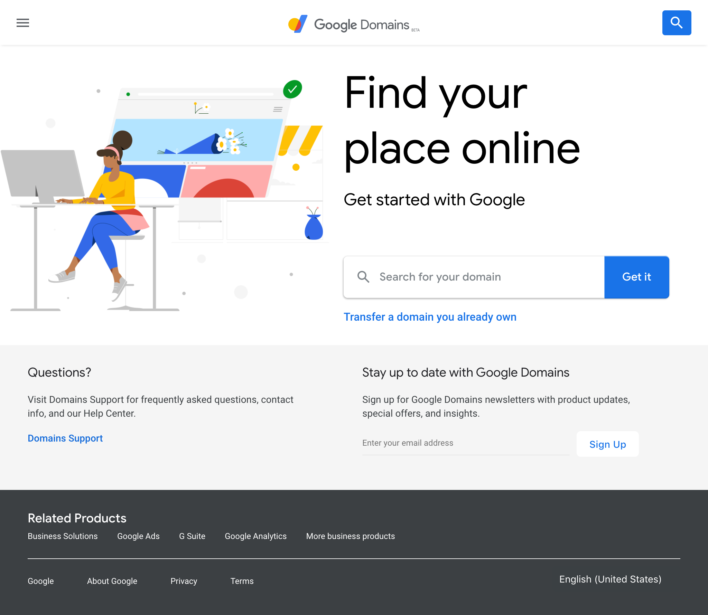
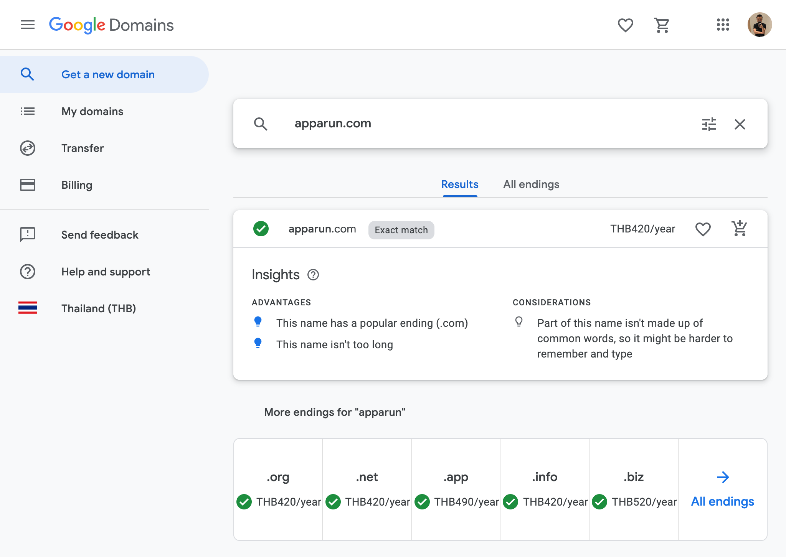
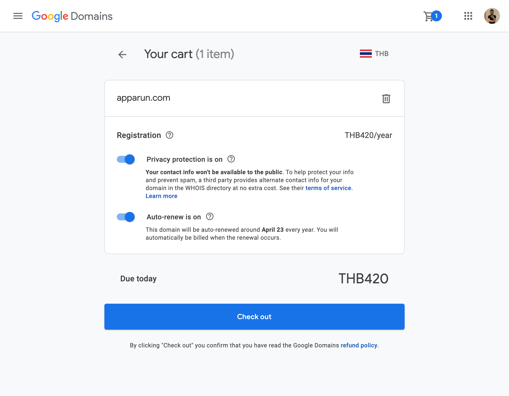
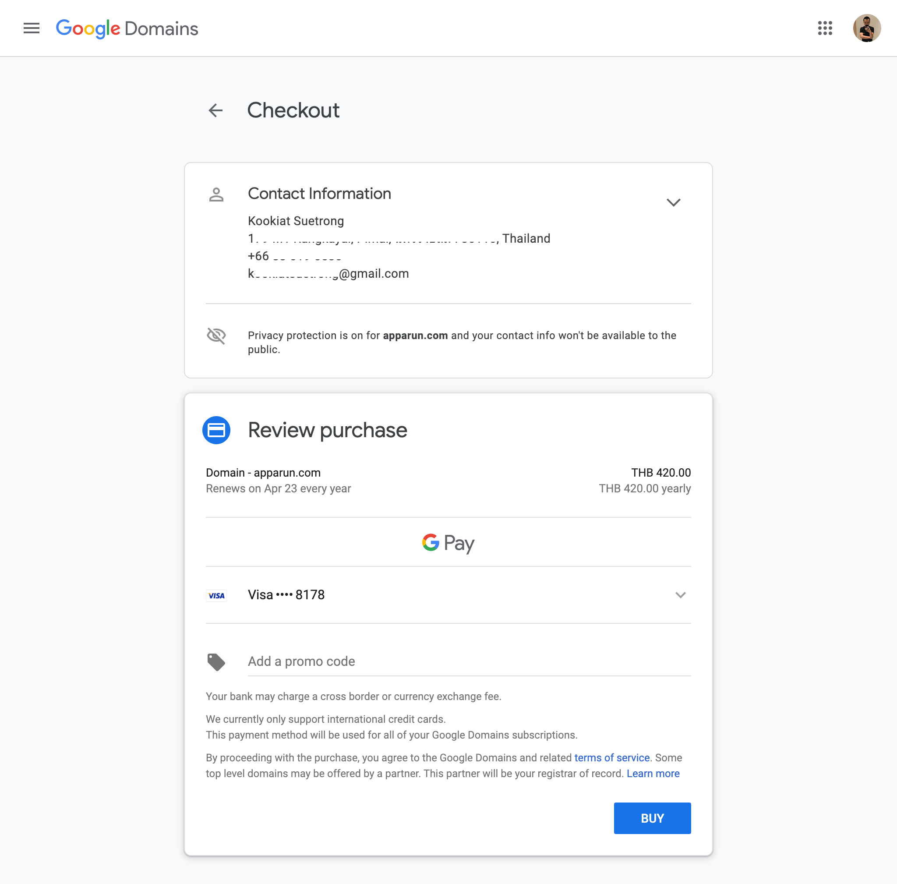
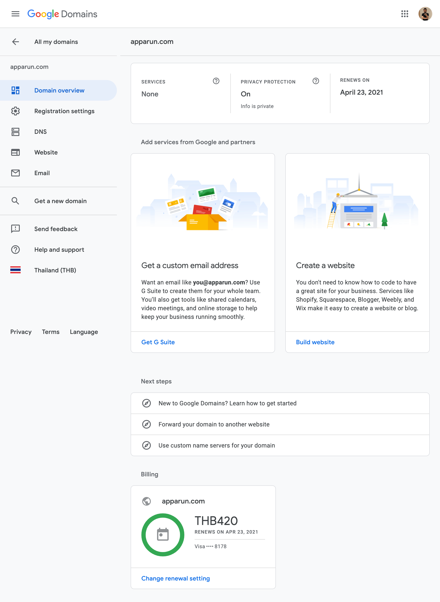

# Register Domain Name

This article is going to show you how to 
register domain name from Google. It 
might cost more than other registrars
for just only 2-3 dollars,
but it will be easier to do some
things more complicated such as
setting up emails.

Let's start by go to the web site
https://domains.google

Then you can enter any domain name that you
wanted.

If the domain name is available, you can
add to your shopping cart.

Proceed to check out.

Finish.

